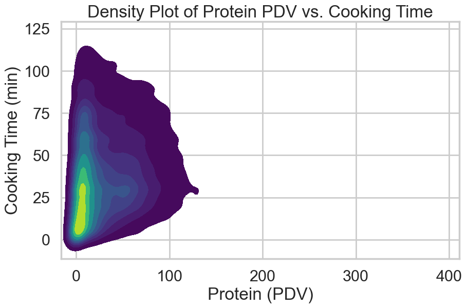

# Flavors of Data: A Recipe Analytics Project
## Introduction:

This dataset contains a collectin of recipes from Food.com, originally gathered and used in a research paper on recommender systems. It consists of two primary components: recipes and interactions. The recipes dataset includes details such as ingredients, preparation time, and nutrition information, while the interactions dataset provides a record of reviews and ratings for the recipes. Due to the large quantity of data, these data are a subset of the original dataset, focusing on recipes and reviews posted since 2008. By merging the recipes and interactions datasets, one can analyze the popularity of recipes and identify trends in recipe charactersitics. The data provides valuable insight into user preferences, rating behaviours, and recipe features, making it a useful resource to explore recipe trends.

### Information About the Dataset:
- Number of rows in the recipes dataset: 83782
- Number of rows in the ratings dataset: 731927
- Number of rows in the left merged recipes and interactions: 234429

### Relevant Columns:
- 'minutes' - minutes to prepare recipe
- 'n_steps' - number of steps in recipe is useful as it could be indicative of how complex a recipe is which could lead to more time creating it
- 'nutrition' - Nutrition information in the form [calories (#), 
total fat (PDV), sugar (PDV), sodium (PDV), protein (PDV), saturated fat 
(PDV), carbohydrates (PDV)]; PDV stands for “percentage of daily value”

**Note:** The nutrition column contains lots of valuable information, for example I have extracted the protein (PDV) from the nutrition column and created a protein
column

One of the most relevant things to people when they choose a recipe to create is the amount of time it will take. Personally, if a recipe is going to take a lot of time I simply will not make it and choose something else. Additionally, at times I have found it difficult to consume enough protein, as I have noticed that it often takes longer to make meals that have large quantities of protein in them. This begs the question, **what is the relationship between the protein (as a percentage of daily value) a recipe has, and the amount of time it takes to prepare the recipe**?

## Data Cleaning and Exploratory Analysis
### Data Cleaning
The first step I took in cleaning the dataset was creating a 'protein' column in my dataset, as this would become relevant for answering my question on the relationship between protein and time it takes to prepare a recipe. In order to do so, I first turned all of the values in the nutrition column into lists and turned the ints into floats in the lists. I then created a protein column by getting the fourth element of each list in the nutrition column. 

At this point, I realized there were a few peculiar outliers - for example a recipe titled "How To Preserve a Husband" that was said to take around 1 million minutes. This sort of recipe is irrelevant for my analysis, so I filtered the recipes to include only those with a cooking time under 10 hours, as this is where the vast majority of the recipes are. The number of outliers that did not meet this criteria was about 671, about 0.0126% of the total amount of recipes. I then also realized that there were some irregularities in the protein column (a hot cocoa mix recipe with a protein PDV of 4356% does not make much sense), so I filtered the recipes to include only with under 400% PDV protein. The number of outliers which did not meet this critereia was 19, aobut 0.00106% of the total amount of recipes.

Pictured below is the cleaned recipes dataset.

|   ID   | Name                           | Minutes | Steps | Ingredients                                                                                   | Num Ingredients | Avg Rating | Protein |
|--------|--------------------------------|---------|-------|-------------------------------------------------------------------------------------------------|----------------|------------|---------|
| 111    | 1 brownies in the world best ever | 40      | 10    | ['bittersweet chocolate', 'unsalted butter', '...']                                      | 9                | 4.0        | 3.0     |
| 115    | 1 in canada chocolate chip cookies | 45      | 12    | ['white sugar', 'brown sugar', 'salt', 'margar...']                                     | 11              | 5.0        | 13.0    |
| 118    | 412 broccoli casserole                | 40      | 6      | ['frozen broccoli cuts', 'cream of chicken sou...']                                 | 9                | 5.0        | 22.0    |
| 119    | millionaire pound cake                | 120    | 7      | ['butter', 'sugar', 'eggs', 'all-purpose flour...']                                  | 7                | 5.0        | 20.0    |
| 125    | 2000 meatloaf                                | 90      | 17    | ['meatloaf mixture', 'unsmoked bacon', 'goat c...']                               | 13              | 5.0        | 29.0    |

### Univariate Analysis
<iframe
  src="assets/cooking_time_dist.html"
  width="800"
  height="400"
  frameborder="0"
></iframe>
Cooking times are predominantly relatively short, as shown by the skewed distribution. The most range for a cooking time to be in is 20-39 minutes.

<iframe
  src="assets/protein_dist.html"
  width="800"
  height="400"
  frameborder="0"
></iframe>
The heavily skewed distribution reveals that the vast majority of recipes do not have that much protein. Most commonly, recipes contain less than 10 PDV of protein.

### Bivariate Analysis
<iframe
  src="assets/protein_vs_time.html"
  width="800"
  height="400"
  frameborder="0"
></iframe>
Due to a large amount of data, this plot makes it difficult to see a relationship between protein and cooking time. The least squares line reveals that there is, in fact, a positive relationship. I have restricted this plot to where the data is most highly concentrated in terms of minutes (less than 120).

A density plot reveals the large amount of data centered around low amounts of protein.

### Interesting Aggregates
Although the scatterplot is somewhat inconclusive, finding the average (mean and median) protein PDV in each time range reveals that the average protein PDV is strictly increasing as time increases. 

| time_bin  | mean protein | median protein | count protein |
|-----------|--------------|----------------|---------------|
| 0-10 min  | 13.99        | 6.0            | 11043         |
| 11-30 min | 30.00        | 18.0           | 26268         |
| 31-60 min | 34.77        | 22.0           | 25415         |
| 61-120 min| 40.03        | 24.0           | 12328         |
| 120+ min  | 52.26        | 33.0           | 8726          |

# Assessment of Missingness
## Not Missing at Random (NMAR) Analysis
 The columns with null values are 'name', 'description', and 'avg_rating'. It seems that none of them are likely to be NMAR as 'name' is likely MCAR, while 'description' and 'avg_rating' could easily be linked to other columns in the dataset. For example, the average rating on recipes that have less steps or take less time could be higher as people are more likely to complete the recipe efficiently and feel satisified with their results. The description on less complex recipes with less steps might be missing as simple recipes may not require a description.

## Missingness Dependency
### Dependency of the Description Column
**Minutes:** Using a permuation test with the absolute difference in the mean minutes of recipes including a description and recipes not including a description as the test statistic, I found that the missingness of description was not dependent the amount of time it takes to prepare the recipe, as my resulting p-value was very high (0.6). I used a significance level of 0.05. 

**Contributer ID:** Using a permutation test with the total variation distance (TVD) as the test statistic, I found that the missingness of description was dependent on contributer ID, as my resulting p-value was very low (0.0). Intuitively, this makes sense, as people who don't write a description for a recipe likely don't write descriptions for their other recipes as well. Below the empirical distribution of the null distribution is pictured with the observed TVD. I used a significance level of 0.05.

<iframe
  src="assets/empirical_distribution_of_null_missingness.html"
  width="800"
  height="500"
  frameborder="0"
></iframe>

# Hypothesis Testing
**What is the relationship between the protein (as a percentage of daily value) a recipe has and the amount of time it takes to prepare the recipe?**

**Null Hypothesis:** The average amount of protein in recipes that take less than or equal to 40 minutes is the same as the average amount of protein in recipes that take over 40 minutes.

**Alternative Hypothesis**: The average amount of protein in recipes that take over 40 minutes is greater than the average amount of protein in recipes that take less than or equal to 40 minutes.

To explore this question, I have used a permuation test with a significance level of 0.05. A permutation is effective in this situation because it is non-parametric, meaning it doesn't rely on assumptions about the underlying distribution. Simulating the null hypothesis by randomly shuffling the labels allows us to discover whether the group assignment is arbitrary or not. 

My test statistic is the difference in mean protein PDV in recipes greater that take greater than 40 minutes to prepare and mean protein PDV in recipes that take less than or equal to 40 minutes to prepare. The difference in means is an effective test statistic because I intend to compare averages.

Because my test resulted in an extremely low p-value of 0.0, I reject the null hypothesis. 

**Note:** Due to the skewed distribution of the data, I am using a subset of the original dataset where the minutes are less than 120 for the purposes of this test.

<iframe
  src="assets/distribution_of_null_ht.html"
  width="800"
  height="400"
  frameborder="0"
></iframe>

## Framing a Prediction Problem
**Prediction Problem:** I aim to predict the time required to prepare a recipe.

This is a regression problem with the response variable being the time in minutes. I chose this because the efficiency of cooking is important to me - I enjoy cooking, but I am also busy. I wish to cook efficient recipes. 

I will use R^2 as a metric to evaluate my model. R^2 is effective in this case because it helps measure how well my model explains variation in the response variable (the time it takes to prepare a recipe).

## Baseline Model
This model uses an sklearn pipeline to predict cooking times for recipes based on two quantitative features, the number of steps and calorie content. The pipeline first applies a log transformation to all columns (both features and the target variable) to handle skewness in the data. It then fits a Linear Regression model to predict the transformed cooking time. The dataset is split into training and testing sets, with the model trained on the training data and evaluated using the R² score. Finally, the model's performance is assessed on the test set, providing the test R² score. The test R^2 score is 0.1903, which is quite low. Because of this low R^2, the baseline model is not particularly strong.

## Final Model

## Fairness Analysis
- Group X: recipes with less than 400 calories
- Group Y: recipes with greater than 400 calories

The evaluation metric that I used is root mean squared error (RMSE).

**Null Hypothesis:** The model is fair. Its RMSE for high calorie and low calorie recipes are roughtly the same, and any differences are due to random chance

**Alternative Hypothesis:** The model is unfair. Its RMSE for high calorie recipies is lower than its precision for low calorie recipes.

The test statistic is the difference in RMSE and the significance level is 0.05. With a p-value of 0.004, I reject the null hypothesis.